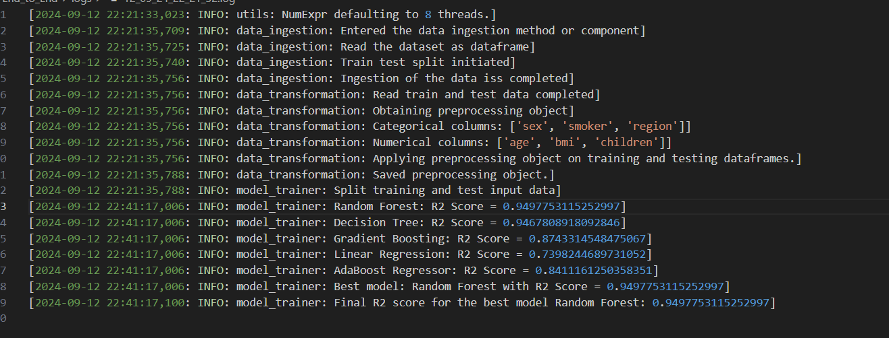
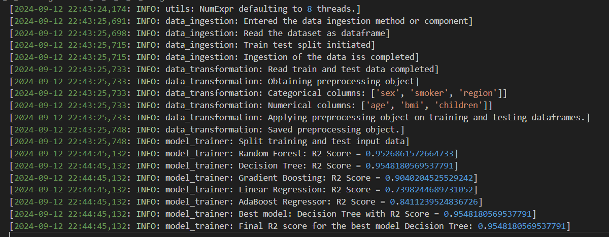

## END To End project ML

# Medical insurance predictor 

- Deep dive in EDA process check it out 
- modeltraining and  preprocessor pkl file added
- with a simple frontend we can test our insurance prediction addtional with the help of api 
- output ss added
- Deep dive in EDA process check it out
## **Overview**
This project involves developing a machine learning model to predict medical insurance premiums based on individual health and demographic data. The model aims to provide accurate forecasts for insurance costs, helping in pricing strategies and decision-making.
Features
- Data Preprocessing: Cleaning and transforming raw data to prepare it for modeling.
- Feature Engineering: Creating and selecting features that enhance model performance.
- Modeling: Implementing regression algorithms, including linear and ridge regression.
- Evaluation: Assessing model performance using metrics like Mean Absolute Error and R-squared.

- 

- log 2 image which i used all the params but my accuracy was not that good

- 

- log 1 image which i optimized and removed some params  and i commented those params  

- 

